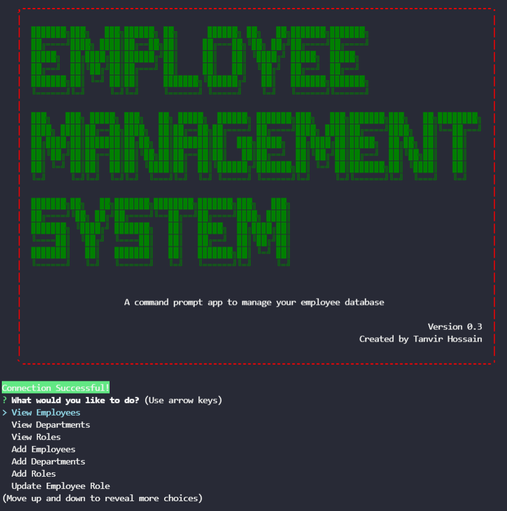
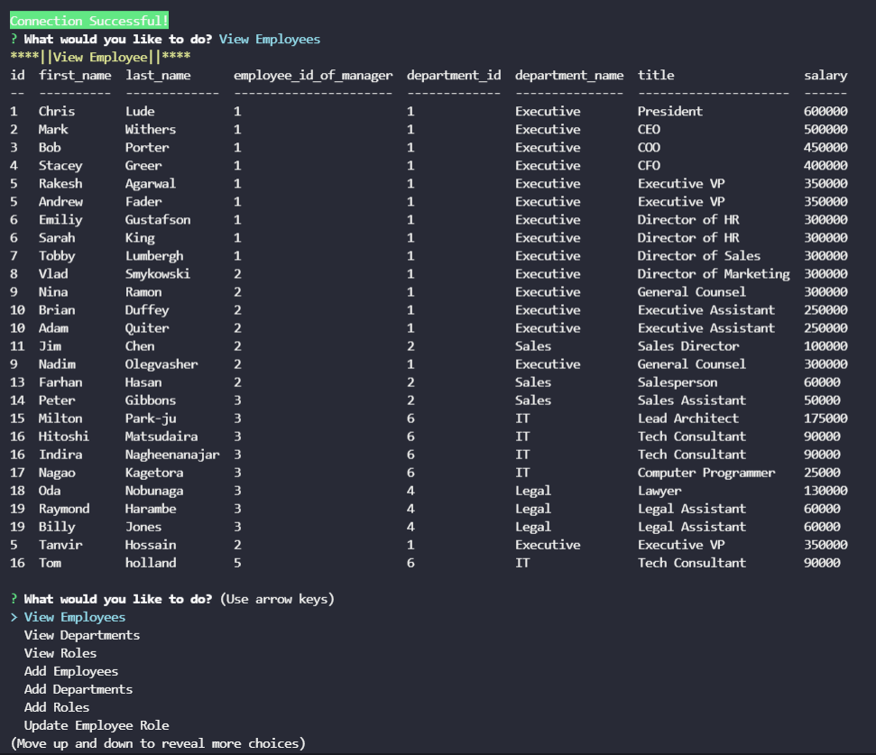
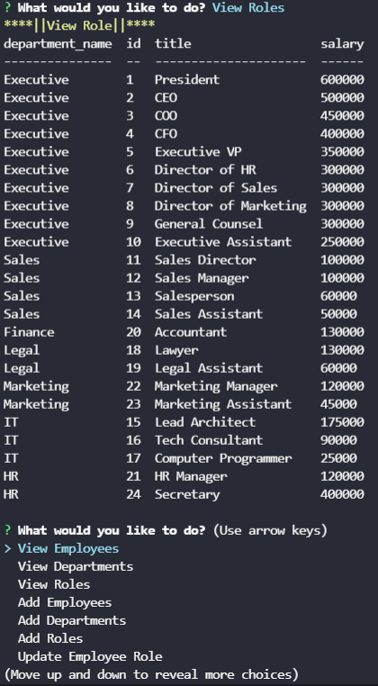
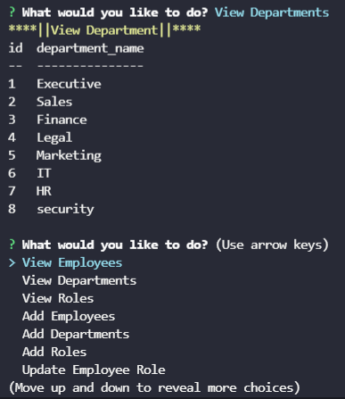

# Employee Tracker

## A command prompt app to manage employee database


<a href="https://img.shields.io/badge/JavaScipt-100%25-yellow"></a> <a href="https://img.shields.io/badge/Used-Node.js-red"></a> <a href="https://img.shields.io/badge/Used-Inquirer-orange"></a> <a href="https://img.shields.io/badge/Used-Dotenv-informational"></a>

## Table of Contents

- [Description](#description)
- [Installation](#installation)
- [Usage](#usage)
- [Walkthrough](#walkthrough)
- [Contribution](#contribution)
- [Test Instructions](#test-instructions)
- [License](#license)
- [Contact Information](#contact-information)

## Description

    Employee Tracker is a command prompt app to manage employee database. It uses mysql workbench to handle data. It is a very simple app which
    can be used to view and update employee, department, salary and roles.

## Installation  

#### Mysql is needed to create database. Follow the link below to install Mysql in your computer
#### To run this code repo in your computer, user must install Node.js. 
#### User also need the following dependencies

    * Inquirer
    * mysql2 
    * Dotenv 
    * Console.table 
    * Ascii-art logo 
    * Chalk 
    * Util 
    * Jest (To run test)

- open terminal
- clone the repo: `https://github.com/thossain89/Employee_Tracker.git`
- cd into new directory (Must be in directory to work) 
- Download all dependency package by entering `npm install`


## Usage


```
Its a simple app. Run "node server" in your preferred command prompt terminal and you will see a welcome screen with options which can be navigate by using arrow keys.
```


## Demo of Employee Tracker :

  

 



 

## Walkthrough

### A link of a walkthrough video of how to use the app is given [here](https://drive.google.com/file/d/1kBxNxCk128QboaJidTXNTu7gpbZ2jgcs/view).


## Contribution

If you would like to contribute to this project reach out to me. Contact Information can be found below or by clicking on the 'Contact-Information' link provided in the Table of Contents.

## Test Instructions
#### For testing user must install Jest dependency in Node.js module
#### You must Download jest to conduct any test in this repo  
- Download jest in cmd by running the code `npm install jest`
- Then run: `npm run test` in console


## License

<a href="https://img.shields.io/badge/License-MIT-brightgreen"></a>

## Contact Information

[Email Address](tanvirhossain2006@gmail.com)

[Github Repo ReadMe Generator](https://github.com/thossain89/Team_Profile_Generator.git)

## Authors   

  


* **Tanvir hossain** [Git Hub Profile](https://github.com/thossain89)  

&copy; 2021 Tanvir Hossain, Coding Bootcamp ,University of Sydney and Trilogy Education
